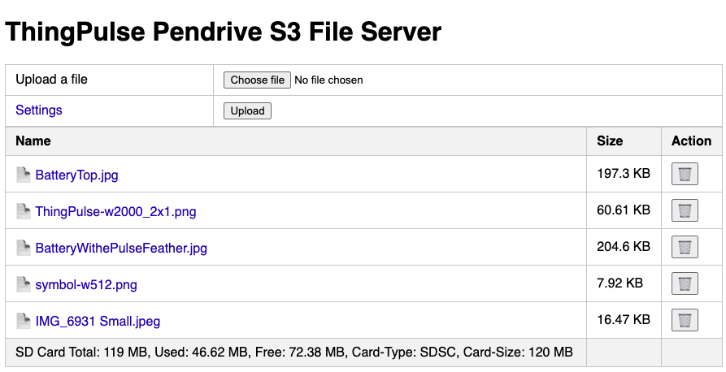
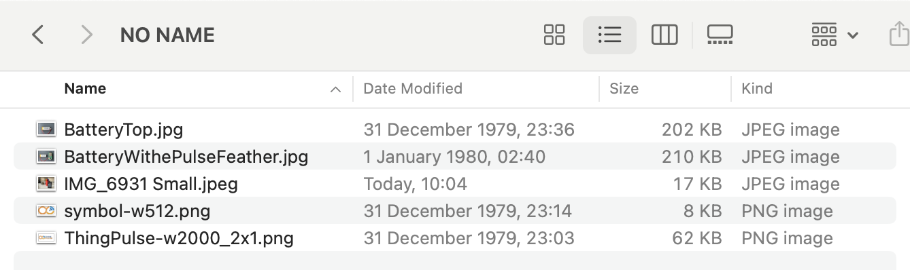
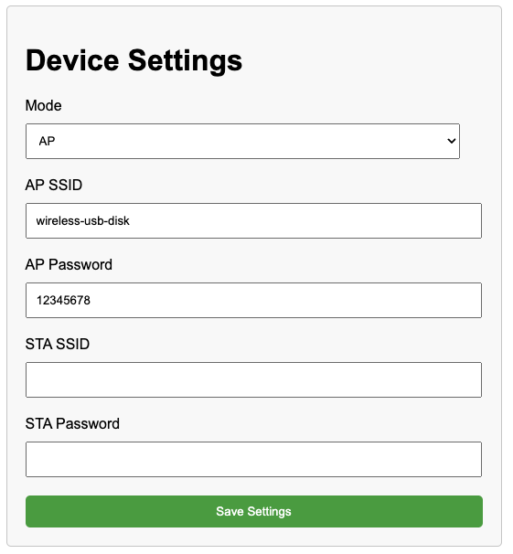

ThingPulse Pendrive S3 - Wireless USB Disk
==========================================

This code is made for the Pendrive S3: https://thingpulse.com/product/esp32-s3-pendrive-s3-128mb/

# What Does It Do?

After plugin the device into a computer it will mount like a regular
memory stick. At the same time it starts a WiFi Access Point
with a webserver. A user can then access the files stored on the 
memory stick over this web interface.

# How To Build & Flash

1. Checkout this repository with git
2. Open with VS Code
3. Setup Platformio for VS Code
4. Build and upload the sample

# How To Use

## Accessing Files Over the Web Interface

When the device is plugged in it will mount a mass storage device with
about 120MB of space. At the same time it starts a WiFi Access Point
`wireless-usb-disk` with password `12345678`. By connecting to this access
point the files on the memory stick can be accessed in the browser: http://192.168.4.1

The Web View:

The Data On the Memory Stick:

## Uploading & Deleting Files

You can delete and upload files over the web interface as well. Please note that changing 
files over the web interface will restart the device to make the changes visible on the host
computer.

## Settings

By clicking on the `Settings` link you can change the WiFi settings of the device.

 * Mode: AP (Access Point), STA (Device connects to access point), AP + STA (both)
 * AP SSID/ Password: credentials of the access point the device will start in AP mode
 * STA SSID/ Password: credentials of the WiFi network where the device will connect to in STA mode

## LED

The color of the LED changes when the host computer reads or writes to the device:
 * Red (50, 0, 0) when the host computer writes
 * Green (0, 50, 0) when the host reads
 * Brown (50, 50, 0) when there were read and write operations in the last 0.5s
